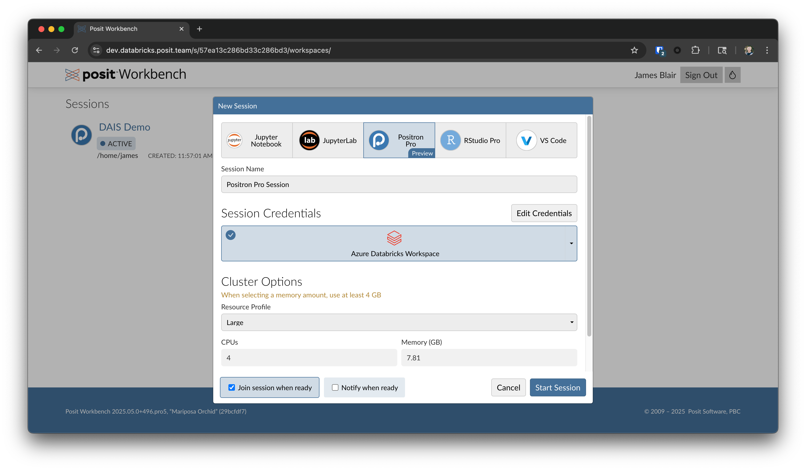
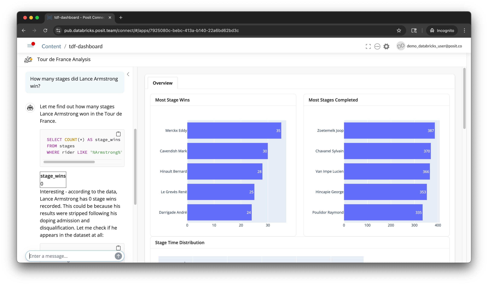

# Next-Gen Data Science
## How Posit and Databricks Are Transforming Analytics at Scale

This repository contains slides and examples used at a [talk](https://www.databricks.com/dataaisummit/session/next-gen-data-science-how-posit-and-databricks-are-transforming) given at Data and AI Summit in June 2025.

There are two example Shiny dashboards in this repository: [`app.R`](app.R) and
[`app.py`](app.py). As suggested by their names, they are nearly identical
dashboards, one written in R and the other in Python. Both dashboards are
designed to analyze the Tour de France stages dataset that was provided as part
of the [TidyTuesday
challenge](https://github.com/rfordatascience/tidytuesday/blob/main/data/2020/2020-04-07/readme.md).

### Positron for Data Analysis and App Development
Positron is a next-generation data science IDE from Posit. It provides many of
the features of RStudio, but in a more modern and flexible environment. It is
designed to help data scientists and developers carefully analyze data and then
build, deploy, and manage data-driven applications with ease. Positron was used
extensively in the development of this example and demonstrated in the
accompanying talk.

### GenAI Assisted Development
Positron includes "Positron Assistant", which is a GenAI-powered assistant that
can help you write code, debug, and analyze data. In this example, the
assistant was used to generate the initial code for the dashboard and to
provide suggestions for improving the analysis. The assistant was also used to
generate the README file and other documentation for the project.

### App Development
Positron makes it easy to develop interactive applications using popular
frameworks in both Python and R. The two example apps here were created in
`shiny` and developed with the help of the Shiny Assistant, which is accessible
via Positron Assistant using `@shiny`. The assistant can help you create UI
components, server logic, and even generate sample data for testing your app.
The app is designed to be interactive and allows users to filter and analyze
the Tour de France dataset in various ways.

### Accessing Databricks Foundational Models
The app uses Claude 3.7 Sonnet via Databricks in order to convert natural
language queries into SQL filters. This is done via the [`querychat`
package](https://github.com/posit-dev/querychat) for both Python and R. The only
user input to the app is the natural language query, which is then converted
into SQL. This generated SQL is then submitted to Databricks for execution and
the results are displayed in the app, allowing users to explore the data in a
more intuitive and flexible way.

### Deployment
The applications can be deployed to Posit Connect or, in the case of the Python
app, as a [Databricks App](https://www.databricks.com/product/databricks-apps).
Once deployed, these apps can be easily shared with others.

### OAuth Support
Posit Workbench and Posit Connect both support Databricks OAuth. This
dramatically simplifies the process of connecting to Databricks from Posit.
Developers using Posit Workbench can sign into their Databricks workspace when
they start a session and then any tool that interacts with Databricks (e.g.,
`querychat`) will automatically use the OAuth token for authentication:

Once deployed to Posit Connect, these apps use OAuth tokens available within
Posit Connect to securely connect to Databricks. This means that unique visitors
to the same application can see different views of the data depending on their
Unity Catalog permissions. In this example app certain users are prevented from
seeing the stage results of cyclists convicted of doping. When these users visit
the dashboard, doped cyclists are not shown:

